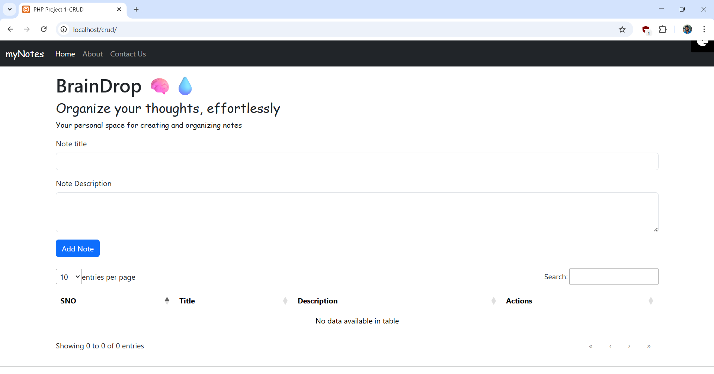

# BrainDrop – Notes Management Web Application

---

## Project Type
- CRUD Web Application
- Notes Management System

---

## Features
- Create notes
- View notes
- Update notes
- Delete notes
- Dynamic table view
- Search functionality
- Pagination and sorting
- Responsive UI

---

## Tech Stack
- Core PHP
- MySQL
- HTML
- CSS
- Bootstrap
- DataTables
- SQL

---

## Database
- MySQL
- phpMyAdmin
- SQL Queries
  - INSERT
  - SELECT
  - UPDATE
  - DELETE

---

## Setup Steps
- Clone repository
- Move project to `htdocs`
- Start Apache and MySQL (XAMPP)
- Create database
- Import `.sql` file
- Run project in browser

---

## Learning Outcomes
- PHP–MySQL connectivity
- CRUD operations
- Form handling (GET, POST)
- Server-side logic
- Dynamic data rendering
- Bootstrap integration
- DataTables integration

---

## Screenshots

### Notes Dashboard

### Add Note

### Edit Note

### Delete Note

---

## Author
- Name: Vinay Kumar Korakoppula
- GitHub: https://github.com/Vinay-1103

